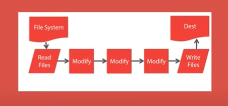

# Gulp Crash Course 

## What is Gulp 
1. Open Source Javascript Toolkit & Task Runner 
2. Front End Build System 
3. Built On Node.Js And Npm 
4. Used For Time Consuming & Repetitive Tasks 
5. Have Hundreds Of Plugins Available For Different Tasks

### Common Tasks 
1. Minification Of Scripts And Styles.
<!-- Minification means taking the file and remvoe all comments all white space which makes it lighter in turn to make application  faster  -->
2. Concatenation
3. Cache Busing 
4. Testing, Linting & Optimization
5. Dev Servers

## How Gulp Works 
1. Gulp Build on [node steams](https://www.freecodecamp.org/news/node-js-streams-everything-you-need-to-know-c9141306be93/)(a continuous flow of data that can maipulated  asynchronously)  these streams facilitate the connection of file operations  through some thing called ⬇️

2. Pipeline (a chain  of processing elements and they're a range so that the output of one element is actually the input of the next element). so you can essentialy set up ⬇️

3. Single Purpose Plugins ( to run task after task) and this all dont using   `.pipe()` operator 

4. Files Not Affected Until All Plugins Are Processed

## Gulp vs Grunt 

1. Gulp is code over configuration. Grunt is configuration over code.

2. Gulp is easier to read than Grunt 
3. Gulp is based on streams, Grunt is based on files 

 
