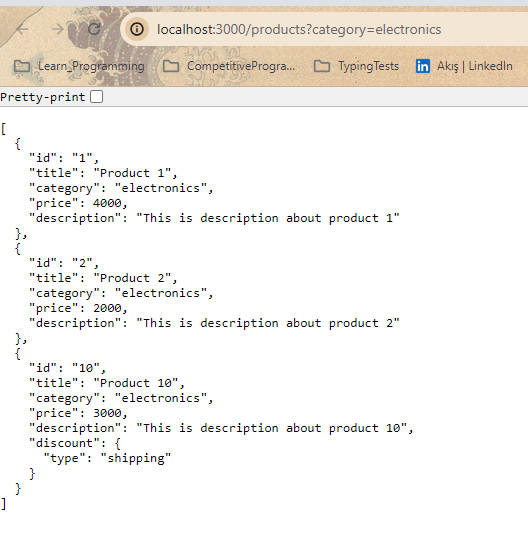

- [What and why we need it](#what-is-json-server-and-why-we-need-it)
- [Get Request](#get-request)
- [Filtering](#filtering)
- [Sorting](#sorting)
- [Pagination](#pagination)
- [Operators ](#operators)
- [Full Text Search](#full-text-search)
- [RelationShips](#relationships)
- [Post Request](#post-request)
- [Put,Patch,Delete Requests](#putpatchdelete-requests)
- [Configurations]()
- [Generate Random Data ]()


## What is Json Server and why we need it 

Json server is a npm package that lets us create fake REST API's with zero coding.

As a frontEnd dev , we constantly need mock data that we can use to quickly protoype front end components.

and the data need to be fetched synchrounously and the APIs should support not just GET but also PUT and DELETE requests.

<!-- creating a node express mongodb or another backend is pretty time consuming so if you are Front End develop we highly recommend you to learn and understand how to work with this package as it will save you a lot of time while you prototyping -->


**Setup JsonServer**
if you don't use any framework or library you need to setup 'json-server' by open the terminal and run the command `npm init -y`  now you'll have 'package.json' file created with some  defaults and then install 'json-server' package by run `npm i json-server` the third and last step we need to add a  new script in our package.json file to start the server 


<!-- where -p is port number and -w mean watch  -->
so our server will now continuously monitor db.json file  and serve the latest data. after this to run the server open the terminal and run `npm run serve-json` after we run this command, from browser if we navigate to 'localhost:3000'

we will see something like image above 

<!-- TODO : add links here to  http notes when you finish it  -->
and what we learn in the series is  how to query and mutate this json file through API end-points

## Get Request 

learn json-server is all about learning  how it exposes the various endpoints for us to make requests from the client

now to access the list of products all we have to do is 
change the url to 
_after running the server if we didn't_
`http://localhost:3000/products`
and we'll get this result 


by the way products or reviews in teh url corresponds to the entries in our db.json


the backend(json-server) will typically  provide  a seperate api which accepts the product id  and returns details about that product. 


## Filtering 

let's say we're building an E-commerce site and the user should have an option  to filter the list of products  for our example by category 

as a frontEnd dev how to do i ask json server to  give products whose category is 'electronics'.

filtering the data  is really simple to the url which is 
`localhost:3000/products` we gonna append __query parameter__ 
`localhost:3000/products?ThePropertyWeWantToFilterBy=filterValue` in our case that mean 
`http://localhost:3000/products?category=electronics`


it is also possible to filter on deeply nested properties for example product with id:10 which have an additional property called discount which is an object with a property called type set to shipping  now lets filter all products whose category is electronics and discount type is shipping

in the addressBar we keep the category filter as is and adding the discount filter by adding `&discount`  but is the _discount type we need to filter_ so to access the nested property we use `.` like we would when we writing code and as a result our url should be 
`http://localhost:3000/products?category=electronics&discount.type=shipping`


## Sorting

A common requirement on the frontendDev is being able to sort a list of items.

for our scenario let's say we need this list of products  sorted by "price" property 

to do this we need to navigate to `localhost:3000/products?_sort=propertyWhichWeWantToSortingOn`
by default the sort order is 'ascending'
 
if we want 'descending' as the sort order  we need to append `&_order=desc` or `localhost:3000/products?_sort=-propertyWhichWeWantToSortingOn` 


sometimes we might want sorting by multiple fields in our scenario we have 3 items with price 4000  lets say we want the next level of sorting by category to accomplish that we need to make modifications in the url 
`localhost:3000/products?_sort=propertyWhichWeWantToSortingOn,anotherProperty&_order=desc,asc` or 

`localhost:3000/products?_sort=-propertyWhichWeWantToSortingOn,anotherProperty`

> by using '-' before the property we want to sorting on we say that the order will be descending


## Pagination 
Right now if we navigate to 'localhost:3000/products' we get all items in products array but when we display a list of products or we have table the pagination is something we have to support. 

to paginate the data we append `?_start=startPointWhichIsExclusive` and limit `&_limit=numberOfItemsWeWannaGet`


Instead of limit we can use `_end`it Works similarly to   Array.slice  but ( _start is exclusive _end is inclusive)


## Operators 
in this section we'll take a look at operators that json-server provide to tweak the data being fetch.

- Work with range of values : for example let's fetch all products whose price lies in the range between  2000 and 6000 to filter by price range we use two operators `_gt` for greater than  and `_lt` for less than the syntax is `?thePropertyWeWantToApplyTheRange_gte=thePriceWeWant&_lte=TheHigherPriceWeWant` 

>  Doesn't work properly with both of gt and lt this i will take notes after knowing the reason


- Not equal operator `http://localhost:3000/products?price_ne=3000`


## [Full Text Search](https://github.com/typicode/json-server/pull/558) 

using to perform full text search on the file and to try it using `?q=` as query parameter followed by `searchString`  


## RelationShips 

when we're working with an sql database it is common for an API  to join two tables and return the joined data..
for example when fetching the list of product we may wanna fetch the corresponding reviews. 

to query our json.db file to include children (add reviews as part of the product object)resources when fetching the data  we use `_embed` keyword 

> someThing went wrong i will update this note one i solve it 

## [Post Request](https://youtu.be/Gb1NN3CJhiA?si=jDBNNKp96jNzdY-t) 


## [Put,Patch,Delete Requests](https://youtu.be/iNps8SBv-1A?si=35iaC0Q_80xVMc_Y)

> A put, patch or deleter requester will always contain the Id of the item.


Put and patch requests both using for updating the object but there are differences between them the [differences are](https://medium.com/@kamaleshs48/difference-between-put-post-and-patch-35ed362e05e9) :

Put Requst:  needs the entire object even when modifying a single property. Because The PUT method is used to replace an existing resource with a new representation.


Patch Request : using for modifying on property with out worrying about the other properties on the object.Because  The PATCH method is used to partially update an existing resource. It applies modifications to the resource, rather than replacing it entirely.


## Configurations 


two configurations that can help when using json-server 

1. Specifiying the port Number : by default json server run on port 3000  but we might already have a different app that  running on that port in such cases we can specify the port option  when starting json server  by change the number in server-json script `json-server -p PortNumber -w fileName.json`


at this moment we have specific route to access a list of products or and individual product  our company might have a specific naming convention when it comes to API  so let see how to set
2. The Custom Route Configurations :  beggging by creating a new json file in the project folder  let's called `routes.json` within the file let's specify a simple json which contains custom route name and the mapping to routes  from json server 
```js

  "/api/v1/*":"/$1"
  This structure is commonly used in reverse proxy settings or in URL rewrite rules of a web server. This specific example defines a rule for how incoming requests that match a certain URL pattern should be redirected or rewritten. Let me explain it in more detail:

"/api/v1/*":"/$1"

Explanation:
  /api/v1/*: This represents the URL path that starts with /api/v1/ followed by any sequence of characters (denoted by the * symbol). So, any request that starts with /api/v1/ will match this rule.

  /$1: This shows how the rewritten URL will look. $1 refers to the portion of the original URL that matches the * in the pattern. In other words, it captures the part of the URL that comes after /api/v1/ and uses it in the rewritten URL.

example 
Incoming request: /api/v1/users

Rewritten URL: /users
Incoming request: /api/v1/products/123

Rewritten URL: /products/123
```
after adding the routes that we want we need to inform json server to make use of this custom routes so in package.json   we specify another  option `--routes routes.json`
> Note that Custom route configuration doesn't work now i think it is not supported anymore


## Generate Random Data 
I Will Cover later 
