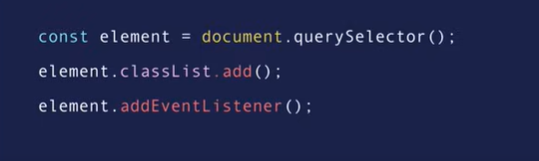

<blockquote style="text-align:center;font-size:32px;">
  <b>The easiest way to learn new things is to do it the hard way</b>
</blockquote>


# What is React any way ?
**Why do we care about React?**
What is React, and why should we use it? When should we use it?
- React is a JavaScript library, not a framework.

**Hah you are throwing new jargons at me  what the hell are library and frameworks**
*Library:* A set of tools you can use when you choose. You stay in control of the flow of your app.

*Framework:* Gives you a full structure and often tells you how to build your app, sometimes taking control away from you.

React is just a library. With mainly focuses on building the view layer of an application — nothing more, nothing less.So its main responsibility:
  - Render the view.
  - Keep the view in sync with the state.

For extra features (e.g., routing, HTTP requests), we use third-party libraries.

---

## React’s Core Idea: Components
React using the approach of creating components (compenent is a piece of the user interface) so when we build an app with React *we build a bunch of independent isolated reusable componenets*. To build a UI, a React app must contain at least one component, which acts as the root of the application. This root component then holds other child components, effectively making every React app a tree of components.

---

**Each Component is a React Element**

- A React element *is the return value of a JavaScript class or function* (usually function).
- It is not a real DOM element — it’s just a plain JavaScript object that maps to a DOM element.
- React keeps a lightweight representation of the DOM in memory, which is called the **Virtual DOM**.

> Unlike the browser’s Real DOM, the Virtual DOM is cheap to create.

---

**How React Work and how its different from Vanilla JS**
In vanilla JS or jQuery, we manually:
- Query and manipulate DOM elements.
- Attach/detach event handlers.
  


In React, we don’t deal directly with the DOM:

- We just update the state of components. When the state of a component changes:

    - A new React element is created.

    - React compares this new element (and its children) with the previous one.

    - React figures out what has changed.

    - Only the necessary parts of the real DOM are updated.
  
---

### JSX (JavaScript XML)

Syntax sugar that we use to write components. It looks like HTML, but it is not HTML. JSX gets compiled into plain JavaScript objects (React elements).

**Some rules while using JSX:**

1. JSX expressions must have **one parent element**.

2. You can assign JSX to a **variable** and render it.

3. When you `console.log` JSX, it appears as a **plain JS object**.

   ```jsx
   const element = <h1>Hello React</h1>;
   console.log(element);
   ```

   Output is:

   ```js
   {
     $$typeof: Symbol(react.element),
     type: "h1",
     key: null,
     ref: null,
     props: { children: "Hello React" },
     _owner: null,
     _store: {}
   }
   ```

   At this stage, it’s not recognized by the browser as real DOM.
   Only when passed to `ReactDOM.render`, React turns it into real DOM elements.

4. When using `{}` inside JSX, everything inside is treated as **JavaScript**.

   * Example:

     ```jsx
     const name = "React";
     const element = <h1>Hello, {name}</h1>;
     ```
   * We also use `{}` to pass **data types as props (attributes)** to components.

     ```jsx
     <User age={25} isActive={true} />
     ```

--- 

### Props

Each component in React is a **React element**, and each element is the return value of a function or a class.
Just like normal functions or classes can take **parameters**, React components can take **props**.

**Props** allow us to:

* Pass data into components.
* Make components **reusable**.
<!--  TODO : * Build **composable** components that work together. -->

> React element receive the props as an object

* So we can use them directly : 

```jsx
// A component that receives props
function Welcome(props) {
  return <h1>Hello, {props.name}!</h1>;
}

// Using the component with different props
// when we pass a prop we should be sure 
// that the attribute name is the same as the prop name in the component
function App() {
  return (
    <div>
      <Welcome name="Alice" />  
      <Welcome name="Bob" />
      <Welcome name="Charlie" />
    </div>
  );
}
```


* Or Using object destructuring
```jsx
// A cleaner way: destructuring props
function Welcome({ name }) {
  return <h1>Hello, {name}!</h1>;
}

function App() {
  return (
    <div>
      <Welcome name="Alice" />
      <Welcome name="Bob" />
      <Welcome name="Charlie" />
    </div>
  );
}
```


####  Important Note about Props

When we pass props to a component, the **prop name must exactly match** the attribute name we used when rendering the component.
React will only recognize the property if the names match.

For example:

```jsx
function Welcome({ name }) {
  return <h1>Hello, {name}!</h1>;
}

// Rendering
<Welcome name="Alice" />   // ✅ works
<Welcome Name="Alice" />   // ❌ won't work (capital "N" is different)
```

---


#### Passing an Entire Object as Props

Sometimes you may want to pass a whole object into a component.
A common way is to wrap the object inside a single prop:

```jsx
<Card item={item} />
```

In this case, inside the `Card` component you would access it as:

```jsx
function Card({ item }) {
  return <h2>{item.name}</h2>;
}
```

So here `item` itself is the prop, and all the data is inside it.

---

##### Spreading an Object into Props

Instead of wrapping the object in one prop, you can **spread the object** into the component’s props:

```jsx
<Card {...item} />
```

This takes every property of the object `item` and turns it into an individual prop.

For example, if `item` looks like this:

```js
const item = {
  id: 1,
  name: "React",
  price: 100
};
```

Then `<Card {...item} />` is the same as writing:

```jsx
<Card id={item.id} name={item.name} price={item.price} />
```

---

**Inside the Component**

Now your `Card` component can receive those props **individually**:

```jsx
function Card({ id, name, price }) {
  return (
    <div>
      <h2>{name}</h2>
      <p>ID: {id}</p>
      <p>Price: {price}</p>
    </div>
  );
}
```


###### Overwriting a Property with Spread Syntax

Sometimes, we want to pass all the properties of an object as props but **change just one of them**.
We can use the **spread operator** `...` to copy the object, then overwrite the property we want.

```jsx
const user = {
  name: "Alice",
  age: 25,
  isActive: true
};

// Passing all props from "user", but changing "isActive"
<Profile {...user, isActive: !user.isActive} />
```

What happens here:

* `...user` → passes all the properties (`name`, `age`, `isActive`).
* `isActive: !user.isActive` → overwrites only the `isActive` property with the opposite value.

So if `user.isActive` was `true`, the component will receive it as `false`.

---


Great, I’ll restructure all of this into clean, **Markdown-friendly notes** with explanations, examples, and highlights so it’s easy to read and revise.

---

### React Events 
[all supported Events legacy](https://legacy.reactjs.org/docs/events.html#mouse-events)

```jsx
export default function App() {
  function handleClick() {
    console.log("I was clicked!");
  }

  return (
    <div className="container">
      
      <button onClick={handleClick}>Click me</button>
    </div>
  );
}
```

**Important Notes:**

* Do **not** write `onClick={handleClick()}`.

  * Writing `()` calls the function immediately during render.
  * We only want to **pass the function reference** so React can call it later when the event happens.
* Correct usage:

  ```jsx
  <button onClick={handleClick}>Click me</button>
  ```


#### Events work just For **native DOM elements** (HTML elements) like : 

* (`<button>`, `<div>`, ``, etc.), React automatically knows about supported event handlers (like `onClick`, `onChange`, `onMouseEnter`, etc.).

  ```jsx
  <button onClick={handleClick}>Click me</button> // ✅ OnClick gonna work because it is native DOM element
  ```
  
* But for **custom components** (Components we Create), React treats everything you pass as **props**, not as event listeners.

```jsx 
// Setting state from child components
<Star isFilled={contact.isFavorite} onClick={toggleFavorite} /> //❌ OnClick Not Gonna Work Because this is a Custom component

```


#### Making Events Work in Custom Components
To making events work in custom components, Inside the Custom component, you must explicitly attach the handler that we passed as prop to a real DOM element:

```jsx


function Star({ isFilled, onClick }) {
  return (
    // attach the prop that we have to Native DOM Element
    <span onClick={onClick}>
      {isFilled ? "⭐" : "☆"}
    </span>
  );
}

export default function App() {
  function handleClick() {
    console.log("I was clicked!");
  }

  return (
    <div className="container">
    // pass OnClick Here as Prop
      <Star isFilled={contact.isFavorite} onClick={toggleFavorite} /> 
      
    </div>
  );
}
```
> Passing functions as props from parent to child components gives the child the ability to update state in the parent.
React does not magically attach event listeners to custom components — you must pass them down and explicitly use them on real DOM elements inside the child.

---


