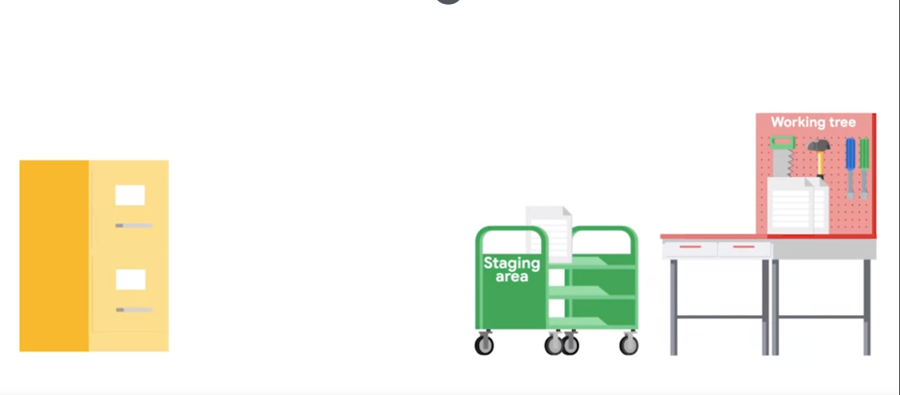
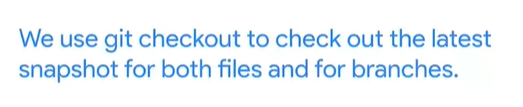
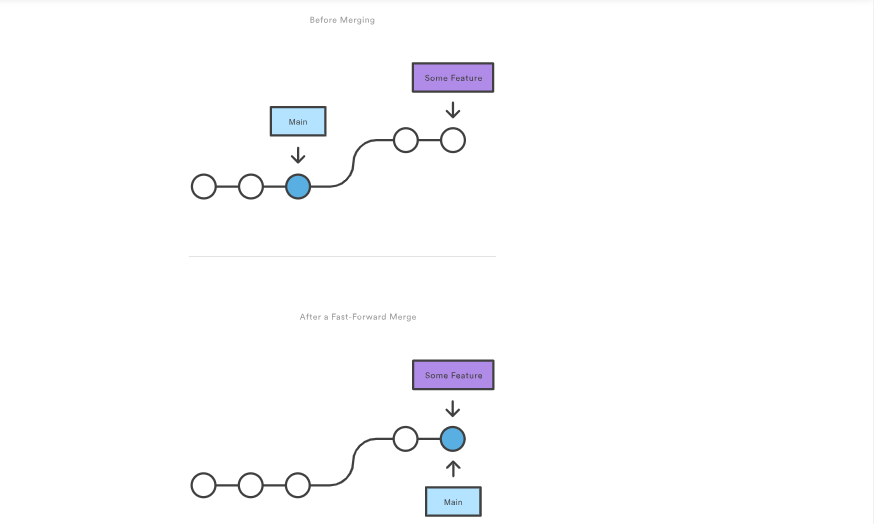
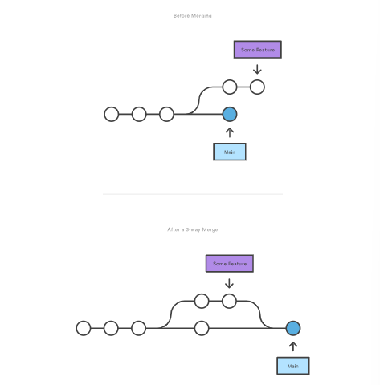
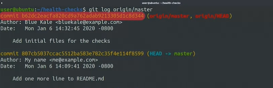

- [Version Control](#1version-control)
  - [Finding the differences](#finding-the-differences)
  - [Generating Diff files](#generating-diff-files)
  - [Applying changes](#applying-changes)
  - [First steps with git](#first-steps-with-git)
  - [Life cycle of each track file](#life-cycle-of-each-track-file)
    <br>
- [Advance Git interaction](#advance-git-interaction)

  - [Skipping the stagin area](#skipping-the-stagin-area)
  - [Getting more information about our changes](#getting-more-informations-about-our-changes)
  - [Deleting and Renaming Files](#deleting-and-renaming-files)
  - [Undoing Changes Before Commiting](#undoing-changes-before-commiting)
  - [Amending Commits](#amending-commits)
  - [RollBack](#rollbacks)
    <br>

- [Branching and Merging](#branching-and-merging)
  - [Working with Branches](#working-with-branches)
  - [Merging](#merging)
  - [Merging Conflicts](#merge-conflicts)
    <br/>
- [Working With Remotes](#working-with-remotes)

  - [Fetching New Changes](#fetching-new-changes)
  - [Updating the Local Repository](#updating-the-local-repository)

- [Terms and definitions](#terms-and-definitions)

## 1.Version Control

### finding the differences

dif take two directroy ar two files and show the differences between them in a few formates


when we call diff command we get only the lines they are different between two files .<remove from the first line ,> stand to added to the second file


- in this example 5c5,6 mean 5th line in the first file replaced by 5,6 in the second file (c mean change )

- 11a13-15 the differences is not obvious here so we can use

```bash
diff -u
```


<!-- wdiff highlights words that changed inside the file
 , meld , Kdiff3  highlighted differences using colors  -->

### Generating diff files

diff -u oldFile new file > changes.diff
**_as a reminder the greater than sign redirects the output of the diff command to a file so with this command we generatig a file called change.diff with the contents of diff -u command_**

- by using -u flag we include more context which help the person reading the file understand what going on with the change
- the generated file usually referred as (diff or patch) file is includes all the changes between the old file and the new one plus the additional context needed to understand the changes and to apply those changes back to the original file

### applying changes

- but we don't need to apply these changes manually because there is a command called **patch** to do exactly this patch takes a file generated by diff and applies the changes to the original file.


now we have the diff file and we want to apply it to our script so we use patch command

 <!-- we use less than symbol to redirect the contents of the file to standard input -->``

```shell
patch nameOfTheFileWeWannaPatchIn  <  changes.diff
```


<br/>

we have seen up till now how we can use existing tools to extract differences between versions of files. and apply those changes back to the original files. Those tools are very useful but most of the time , we won't be using them directly instead , we'll use them through a
**_Version Control System (VCS)_** : which keeps track of the changes that we make to our files(keeps track of all the different versions that we create as we save our changes), by using VCS we can know when the changes were made and who made them . it also lets us easily revert a change, and makes collaboration easier by allowing us to merge changes from lots of different sources.


---

### First Steps with Git

we said earlier that VCS tracks who and when the changes are made for this to work we need to till git who we are to do this we need to use 'git config and setting the values of user email and user name

```git
git config -l // to check out our current configurations
git config --global user.email "me@example"
git config --global user.name "MyName"

# we can use  the below command to show all configurations
git config --list
```

we used the --global flag to state that we want to set this value for all git repositories that we would use.

when that is done there are two ways to start git repositories

1. git init: to create one from scratch
2. git clone: make copy of repository that already exist somewhere else

```git
git init

```

when we run git init we initialize empty git repository in the current directory

which create .git directory which contains:


we can think of it as a database for our get project that stores the changes and the change history we saw that .git contains bunch of different files and directories we don't touch any of these files directly we always interact with them throgh git commands
so when ever we clone a repo this git directory is copied for our computer and when ever we run git init to create a new repo a new git directory is initialized


The git directory acts as a database for all the changes tracked in Git. and the working tree acts as a sandbox where we can edit the current versions of the files(tracked or new files which not tracked yet).

to make git track our file we should add it to the project using

```git
git add
```

with this command we adding our file to staging area


we can use 'git status' command to get some informations about the current working tree and pending changes

to get our files that in staggine area to get it committed into .git directory we run

```git
git commit
```

> You can’t commit with an empty commit message. and if you tried it The commit will be aborted
> [commit style](https://commit.style/)

### life cycle of each track file

Git project will consist of three sections :

1. The Git directory which contains the history of all the files and changes.
2. the working tree which contains the current state of the project, including any changes that we've made.
3. the staging area which contains the changes that have been marked to be included in the next commit(All files that are staged will be part of the next snapshot we take).



---

<!-- Module 2 -->

## 2.Advance git interaction

### Skipping the Stagin Area

```git
git commit -a

# a shortcut to stage any changes to tracked files and commit them in one step(if modified file has been never committed to the repo , we'll still need  to use git add to tracked first  )
```

when we use -a shortcut we skip the stagin area meaning , we can't add any other changes before creating the commit

**What is HEAD and where is it heading?**
Git uses the HEAD alias to represent the currently checked-out snapshot of your project.this let us know what the contents of our working directory should be.

<!-- we'll see head use when we learn how  to undo things and perform  rollbacks. -->

### Getting More Informations About Our Changes

we have seen how git log show us the list of commits made in the current Git repository. By default is , it prints the commit message, the author, and the date of the change. This is useful, but if we're combing through a history of changes in a repo to try and find what caused the latest outage, we'll probably also need _to look at the actual lines that changed in each commit_. To do this with git log, we can use the -p flag.

```git
git log -p
# p comes from patch cause -p will give the patch that has been created
```

another option if we don't wanna scroll down until find the commit that we're actually interested in

```git
git show  CommitIdAsParameter
# if we don't passID  it will log message and diff output of the last commit
```

another interested flag

```git
git log --stat
# this will caus git log to show some stats about the changes in the commit like which files were changed and how many lines added or removed
```

now what about changes that haven't been committed yet?

<!-- unstaged changes -->

```git
git diff
# if our change was bigger and included several files , we could  pass a file by parameter to see the differences relevant to that specific file instead of all files at the same time.


# git diff by default shows unstaged changes  but if we wanna see the differences that staged but not commited we can use

git diff --staged
```

Something else we can do to review changes before adding them is to use

```git
git add -p
#when we use this flag Git will show us the change being added and ask if we want to stage it or not this way we can detect if there's any changes that  we con't want to commit
# it will work on tracked files
```

### Deleting and Renaming Files

we can remove files from ours repository with the `git rm ` which will stop the file from being tracked by git and remove it from the git directory. File removals go through the same general workflow that we've seen. So we'll need to write a commit message as to why we've deleted them.

and we can ust `git mv` to rename files in the repository after rename a file and run `git status` The status shows us that the file was renamed and clearly displays the old and new names.
**As with the previous example, the change is staged, but not committed.**

If there are files that get automatically generated by our scripts, or our operating system generates artifacts that we don't want in our repo, we'll want to ignore them so that they don't add noise to the output of git status. To do this, we can use the gitignore file.
`bash echo .fileName > .gitignore ` we'll specify rules to tell git which files to skip for the current repo. For example, if we're working on an OSX computer, we'll probably want to ignore the dot DS_store file, which is automatically generated by the operating system. To do this, we'll create a .gitignore file containing the name of this file.
his file needs to get tracked just like the rest of the files in the repo.

> Remember that the dot prefix in a Unix-like file system indicates that the file or directory is hidden and won't show up when you do the normal directory listing.

### Undoing Changes Before Commiting

Being able to revert our changes is one of the most powerful features offered by version control systems. There's a bunch of different techniques available depending on which changes we need to undo.

- **Undoing Unstaged Changes**
  `git checkout fileNameWeWannaRevert` git checkout restores files to the latest stored snapshot(which can be either **_commited or staged_**), reverting any changes before staging.
  (discard new hunks from the workTree)

<!-- think of it like you're checkingout the original file from the latest storage snapshot -->

So if we've made additional changes to a file after we've staged it, we can restore the file to the earlier stage version and by using _-p_ flag we can check out individual changes instead of the whole file This will ask us change by change if we want to go back to the previous snapshot or not.

</br>

- **Undoing Staged Changes**
  If we realize we've added something to the staging area that we didn't actually want to commit, we can unstage our changes by using the `git reset` command.
  <!-- git add is adding files  to stagin area and reset for remove files from  it  -->
  by running `git reset HEAD file name `we are resetting our changes to whatever's in the current snapshot (unstage new hunks)

### Amending Commits

Let's say you just finished committing your latest batch of work, but you've forgotten to add a file that belongs to the same change. You'll want to update the commit to include that change. Or maybe the files were correct, but you realize that your commit message just wasn't descriptive enough. So you want to fix the description to add a link to the bug that you're solving with that commit. What can you do? We can solve problems like these using the `git commit --amend` _option which will take whatever is currently in our staging area and run `git commit` workflow to **overWrite** the previous commit_

Important Heads Up :

- `--amend` is okay for fixing up local commit we shouldn't use it on public commits(commits have been pushed to a public or shared repo) and this because `--amend` re-writes the git history removing the previous commit and replacing it with ammended one
  <!-- we push our commit after we fixed it  -->
  > Avoid amending commits that have already been made public
  <!-- git commit --amend allows us to modify and add changes to the most recent commit. -->

### Rollbacks

there are few ways to rollback commits in Git

1. `git revert` : in git revert doesn't mean just undo instead, it creates a commit that contain the inverse of all changes that made in the bad commit in order to cancel them out. this way we will get the effect of having undone the changes, bu the history of the commits in the project remains consistent leaving a record of exactly what happened
   > in another words git revert will create a new commit, that is the opposite of every thing in the given commit

#### Identifiying a Commit

We can target a specific commit by using its commit ID. We've seen commit IDs a few times already. They show up when we're running the git log command.
Commit IDs : are those complicated looking strings that appear after the word commit in the log messages
The commit ID is the 40 character long string after the word commit, you really can't miss it. This long jumble of letters and numbers is actually something called a hash, which is calculated using an algorithm called SHA1.
Essentially, what this algorithm does is take a bunch of data as input and produce a 40 character string from the data as the output. In the case of Git, the input is all information related to the commit, and the 40 character string is the commit ID.

 <!-- why on earth would you use a long jumble of letters as an ID for commit, instead of incrementing an integer, like 123, etc? To answer that, let's take a quick look at the reason why Git uses a hash instead of a counter, and how that hash is computed. Although SHA1 is a part of the class of cryptographic hash functions, Git doesn't really use these hashes for security.
Play video starting at :1:55 and follow transcript1:55
Instead, they're used to guarantee the consistency of our repository. -->

## Branching And Merging

what is a branch? What is it used for? In Git, a branch at the most basic level is just a pointer to a particular commit. But more importantly, it represents an independent line of development in a project. Of which the commit it points to is the latest link in a chain of developing history.

 <!--  TODO ADD IMAGE HERE -->

The default branch that Git creates for you when a new repository initialized is called master.All of our examples and development have taken place on this branch so far. The master branch is commonly used to represent the known good state of a project. When you want to develop a feature or try something new in your project, you can create a separate branch to do your work without worrying about messing up this current working state.
_Branches make it really easy to experiment with new ideas or strategies and projects. When you want to add a feature or fix something, you can create a new branch and do your development there. then You can merge back into the master branch, when you've got something you like, or discard your changes without negative impact if they don't work out._

### Working with Branches

As branches are essential to how work is done int git, there's tons of different ways to work with them we can use `git branch` command to to list, create, delete, and manipulate branches

- to show all branches we run `git branch` itself.

 <br/>

- for create a new branch we call `git branch TheNameOfTheNewBranch` and our new Created branch will **_Created Based On The Value Of Head_**

 <br/>

- for switch to the new branch we can call either `git switch newBranchName` or `git checkout  newBranchName`

  - when we switch to a different branch using checkout under the hood git change where head is pointing (HEAD went from pointing the latest commit in the newFeature branch to the most recent commit of the master and vice versa )
  <!--  We saw earlier how we can use git checkout to restore a modified file back to the latest commit Checking out branches, is similar in that, the working tree is updated to match the selected branch including both the files and the git history.
  this demonstrate that when we switch branches in git, the working directory and commit history will be changed to reflect the snapshot of our project -->

    <br/>

  - > we should use `git commit` in each branch before switching so our changes doesn't get lost between branches

- for create a new branch and switch to it in a single command we run `git checkout -b theNewBranchName`.

 <br/>

- to delete branch we run `git branch -d nameOfbranchWannaDelete` If there are changes in the branch we want to delete that haven't been merged back into the master branch, git will let us know with an error. it we stil wanna delete it `git branch-D branchName`

> One thing to note after all this back and forth, is that each branch is just a pointer to a specific commit in a series of snapshots. It's very easy to create new branches because there isn't any data that needs to be copied around. When we switch to another branch, we check out a different commit and git updates both head and the contents of our working directory.

<!--  -->

### Merging

A typical workflow for managing branches in Git, is to create a separate branch for developing any new features or changes. Once the new feature's in good shape, we merge `git merge ` the separate branch back into the main trunk of code. Merging is the term that Git uses for combining branch data and history together. We'll use the git merge command, which lets us take the independent snapshots and history of one Git branch, and tangle them into another.

Git uses two different algorithms to perform a merge, _fast-forward_ and _three-way merge_. The merge we just performed is an example of a fast-forward merge. This kind of merge occurs when **all the commits in the checked out branch are also in the branch that's being merged**. If this is the case, we can say that the commit history of both branches doesn't diverge. In these cases, all Git has to do is update the pointers of the branches to the same commit, and no actual merging needs to take place.

<!-- <video src="./fastForward.mp4" controls  autoplay title="Title"></video> -->



> As long as there are no conflicts, Git will move the current branch tip up to the target branch tip and combine histories of both commits.

On the other hand, a three-way merge is performed when the history of the merging branches has diverged in some way, and there isn't a nice linear path to combine them via fast-forwarding. This happens _when a commit is made on one branch after the point when both branches split_.



<!-- In our case, this could have happened if we made a commit on the master branch after creating the other branches. -->

_When this occurs, Git will tie the branch histories together with a new commit_. And merge the snapshots at the two branch tips with the most recent common ancestor, the commit before the divergence. To do this successfully, Git tries to figure out how to combine both snapshots. If the changes were made in different files, or in different parts of the same file, Git will take both changes and put them together in the result. If instead the changes are made on the same part of the same file, Git won't know how to merge those changes, and the attempt will result in a merge conflict

### Merge Conflicts

From time to time, we might find that both the branches we're trying to merge have edits to the same part of the same file.
This will result in something called a merge conflict.

if we have a conflict git will throw a conflict error in case of overlap which is prevents loss of work if two lines overlap in this case we should _fix the conflicts_ or abort the merge using `git merge --abort` and we need to run `git add` on each unmerged file to mark that the conflits has been resolved
when we have conflict git will add some information to our files to tell use which parts of the code are conflicting. so it's up to us to decide which one to keep or if we should change the contents of the file altogether
after fix the conflict we will mark it as resolved by runnig `git add` on file and the call `git status` to see how our merge is doing if all conflict are resolved we need to run `git commit` to wrap up the merge

to see what the commit history look like know
`git log --graph --oneline` to show us the log as graph and one line for a commit

---

<!--
[remote branches ](https://www.freecodecamp.org/news/remote-branches-in-git/#:~:text=A%20remote%20branch%20exists%20in,remote%3E%20syntax.)

  -->

## Working with Remotes

When we call a git clone to get a local copy of a remote repository, Git sets up that remote repository with the default origin name.
We can look at the configuration for that remote by running `git remote -v` in the directory of the repo.

_Remote repositories have a name assigned to them, by default, the assigned name is origin_.

If we want to get even more information about our remote, we can call `git remote show origin`

what are the remote branches ? Whenever we're operating with remotes, Git uses remote branches to keep copies of the data that's stored in the remote repository.
We could have a look at the remote branches that our Git repo is currently tracking by running `git branch -r`.These branches are read only. We can look at the commit history, like we would with local branches, but we can't make any changes to them directly.

### Fetching New Changes

we can check if any changes made to the remote repo by running `git remote show origin` and git will tell us that `   main pushes to main (local out of date)` this happen when there were commits done to the repo and this commits doesn't reflected locally.

> Git doesn't keep remote and local branches in sync automatically it waits until we execute commnands to move data around when we're ready

to sync the data we use `git fetch` this command copies the commits done in the remote repository to the local repo so it lets us see how the central history has progressed usign `git log origin/master`,

<!--

# show commit logs of changes
git log master..origin/master

# show diffs of changes
git diff master..origin/master -->



and it doesn’t force us to actually merge the changes into our repository.

Git isolates fetched content from existing local content; it has absolutely no effect on our local development work. _Fetched content has to be explicitly checked out_ using the `git checkout` command. This makes fetching a safe way to review commits before integrating them with your local repository.

### Updating the Local Repository

Earlier, we took a look at the basic workflow for working with remotes when we want to fetch the changes manually, merge if necessary, and only then push any changes of our own. Since fetching and merging are so common, Git gives us the git pull command that does both for us. _Running git pull will fetch the remote copy of the current branch and automatically try to merge_ it into the current local branch.

if we have a new Remote branch which we don't have a local branch for yet. To create a local branch for it, we can run `git checkout theNewBranchName` When we checked out the newBranch, Git automatically copied the contents of the remote branch into the local branch

If we want to _get the contents of remote branches **without** automatically merging any contents into the local branches_, we can call `git remote update`. This will fetch the contents of all remote branches, so that we can just call checkout or merge as needed.

## Terms and definitions

Commit: A command to make edits to multiple files and treat that collection of edits as a single change

Commit files: A stage where the changes made to files are safely stored in a snapshot in the Git directory

Commit message: A summary and description with contextual information on the parts of the code or configuration of the commit change

Diff: A command to find the differences between two files

DNS zone file: A configuration file that specifies the mappings between IP addresses and host names in your network

Git: A free open source version control system available for installation on Unix based platforms, Windows and macOS

Git directory: A database for a Git project that stores the changes and the change history

Git log: A log that displays commit messages

Git staging area: A file maintained by Git that contains all the information about what files and changes are going to go into the next commit

Modified files: A stage where changes have been made to a file, but the have not been stored or committed

Patch: A command that can detect that there were changes made to the file and will do its best to apply the changes

Repository: An organization system of files that contain separate software projects

Source Control Management (SCM): A tool similar to VCS to store source code

Stage files: A stage where the changes to files are ready to be committed

Tracked: A file’s changes are recorded

Untracked: A file’s changes are not recorded

Version control systems (VCS): A tool to safely test code before releasing it, allow multiple people collaborate on the same coding projects together, and stores the history of that code and configuration

Branch: A pointer to a particular commit, representing an independent line of development in a project

Commit ID: An identifier next to the word commit in the log

Fast-forward merge: A merge when all the commits in the checked out branch are also in the branch that's being merged

Head: This points to the top of the branch that is being used

Master: The default branch that Git creates for when a new repository initialized, commonly used to place the approved pieces of a project

Merge conflict: This occurs when the changes are made on the same part of the same file, and Git won't know how to merge those changes

Rollback: The act of reverting changes made to software to a previous state

Three-way merge: A merge when the snapshots at the two branch tips with the most recent common ancestor, the commit before the divergence

<!--  Check out the following links for more information:

https://git-scm.com/doc

https://www.mercurial-scm.org/

https://subversion.apache.org/

https://en.wikipedia.org/wiki/Version_control


 -->

## Todos

- [ ] Revert explain and images (revert to specific commit with out mergin conflict)
