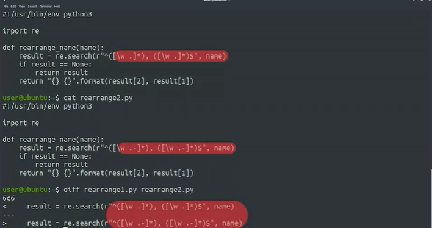
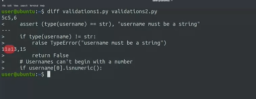
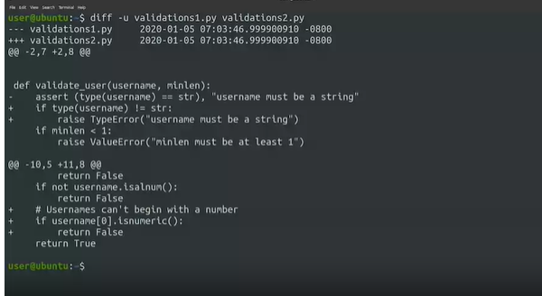
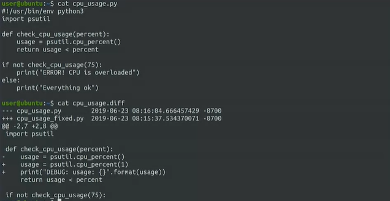
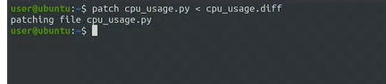
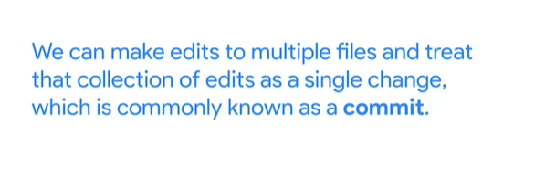
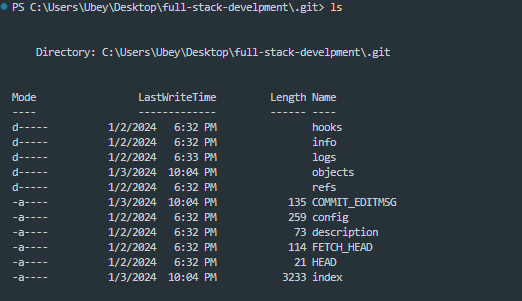
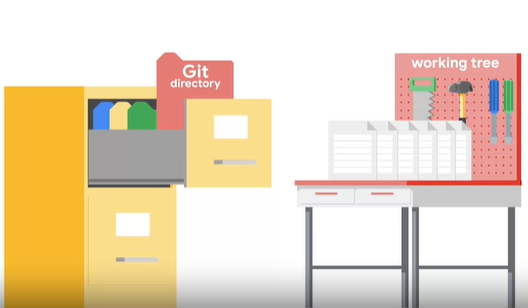
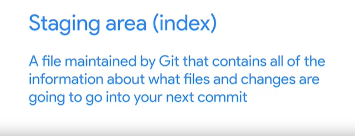

## 1.Version Control

### finding the differences

dif take two directroy ar two files and show the differences between them in a few formates


when we call diff command we get only the lines they are different between two files .<remove from the first line ,> stand to added to the second file



- in this example 5c5,6 mean 5th line in the first file replaced by 5,6 in the second file (c mean change )

- 11a13-15 the differences is not obvious here so we can use diff -u

<!-- wdiff highlights words that changed inside the file
 , meld , Kdiff3  highlighted differences using colors  -->

### Generating diff files

diff -u oldFile new file > changes.diff
**_as a reminder the greater than sign redirects the output of the diff command to a file so with this command we generatig a file called change.diff with the contents of diff -u command_**

- by using -u flag we include more context which help the person reading the file understand what going on with the change
- the generated file usually referred as (diff or patch) file is includes all the changes between the old file and the new one plus the additional context needed to understand the changes and to apply those changes back to the original file

### applying changes

- but we don't need to apply these changes manually because there is a command called **patch** to do exactly this patch takes a file generated by diff and applies the changes to the original file.



now we have the diff file and we want to apply it to our script so we use patch command

 <!-- we use less than sympol to redirect the contents fo the file to standart input -->

```shell
patch nameOfTheFileWeWannaPatchIn  <  changes.diff
```



<br/>

we have seen up till now how we can use existing tools to extract differences between versions of files. and apply those changes back to the original files. Those tools are very useful but most of the time , we won't be using them directly instead , we'll use them through a
**_Version Control System (VCS)_** : which keeps track of the changes that we make to our files(keeps track of all the different versions that we create as we save our changes), by using VCS we can know when the changes were made and who made them . it also lets us easily revert a change, and makes collaboration easier by allowing us to merge changes from lots of different sources.


---

## First Steps with Git

we said earlier that VCS track who and when the changes are made for this to work we need to till git who we are to do this we need to use 'git config and setting the values of user email and user name

```git
git config --global user.email "me@example"
git config --global user.name "MyName"
```

we used the --global flag to state that we want set this value for all git repositories that we would use.

when that done there is two way to start git repositories

1. git init: to create one from scratch
2. git clone: make copy of repository that already exist some where else

```git
git init

```

when we run git init we initialize empty git repository in the current directory

which create .git directory which contains:

we can think of it as data base for our get project that store the changes and the change history we saw that .git contains bunch of different files and directories we don't touch any of these files directly we always interact with them throgh git commands
so when ever we clone a repo this git directory is copied for our computer and when ever we run git init to create a new repo a new git directory is initialize



The git directory acts as a database for all the changes tracked in Git. and the working tree acts as a sandbox where we can edit the current versions of the files(tracked or new files which not tracked yet).

to make git track our file we should add it to the project using

```git
git add
```

with this command we adding our file to staging area



we can use 'git status' command to get some informations about the current working tree and pending changes

to get our files that in staggine area to get it committed into .git directory we run

```git
git commit
```

<!-- life cycle of each track file  -->
